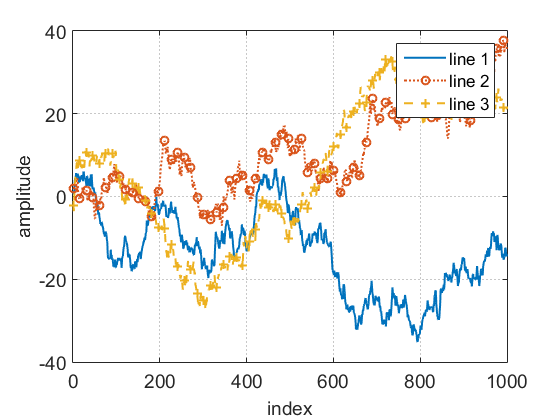
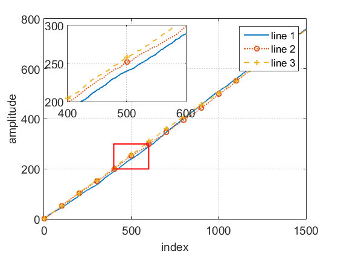

## Flexible matlab functions
## Introducation
Fmatfun is a flexible Matlab function set which integrates the daily-used programs involving figure, data, text and file. It devotes to improve the efficiency of using Matlab and producing materials for writing scientific reports.

Currently, the following functions are available.
* [matfig](matfig) functions for figures
* [demo](demo) demos for how to use fmatfun
    

## Installation
* Download fmatfun
* Run [install.m](install.m) in Matlab 

## Usage at a glance
```Matlab
% demo/matfig_multilines_demo
%% Plot multiple lines and zoom in of the figure
% 多条曲线作图与图像放大
%% Plot multiple lines;多条曲线作图
% Use random number to simulate the lines;用随机数模拟多条曲线
rng(0);
M = 3; N = 1000;
x = 1:N;
y = cumsum(randn(M,N),2);
% All points of the lines are plotted with marker (too dense, the apperance will not look good !!!)
% 曲线的每一点都打上标记 (太密了，影响图像美观性！！！）
[fig_rndlines,~,~,plines] = plotfig(x,y,x,y);  % 注意x,y必须有一维维度相同
xlabel('index'); ylabel('amplitude');
legend(plines,{'line 1','line 2','line 3'});
set_fig_fontsize(fig_rndlines,14);

% 1/15 points will be marked; 抽取1/15的点打上标记
[fig_rndlines,~,~,plines] = plotfig(x,y,x(1:15:end),y(:,1:15:end)); 
xlabel('index'); ylabel('amplitude');
legend(plines,{'line 1','line 2','line 3'});
set_fig_fontsize(fig_rndlines,14);

% Change the line type, marker,color, width; 更改线型、标记、颜色、线宽
[fig_rndlines,~,~,plines] = plotfig(x,y,[],[],{'-','-','-'},{'none','o','*'},{[0.0 0.447 0.741],[0.85 0.325 0.098],[0 0 0]},{1.0});
xlabel('index'); ylabel('amplitude');
legend(plines,{'line 1','line 2','line 3'});
set_fig_fontsize(fig_rndlines,14);

%% Zoom in the figure; 对图的局部进行放大
% 用随机数模拟多条靠得比较近的曲线
rng(0);
M = 3; N = 1500;
x = 1:N;
y = cumsum(rand(M,N),2);
[fig_rndlines,~,~,plines] = plotfig(x,y);
xlabel('index'); ylabel('amplitude');
legend(plines,{'line 1','line 2','line 3'});
set_fig_fontsize(fig_rndlines,14);
% Zoom in and plot in the same figure; 放大并显示在同一幅图上
copy_and_zoom_ax(fig_rndlines,[],[0.2 0.6 0.35 0.30],[400 600],[200 300],'rectangle','-');

% Zoom in and plot in a new figure; 放大并显示在新的图上
rng(0);
M = 3; N = 1500;
x = 1:N;
y = cumsum(rand(M,N),2);
[fig_rndlines,~,~,plines] = plotfig(x,y);
xlabel('index'); ylabel('amplitude');
legend(plines,{'line 1','line 2','line 3'});
set_fig_fontsize(fig_rndlines,14);
fig_rndlines_new = figure;
copy_and_zoom_ax(fig_rndlines,fig_rndlines_new,[],[400 600],[200 300],'rectangle','-');
```
<center class="half">
 
</center>